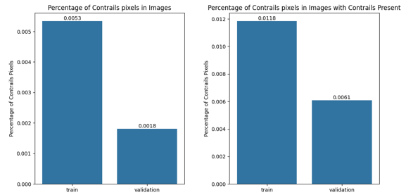
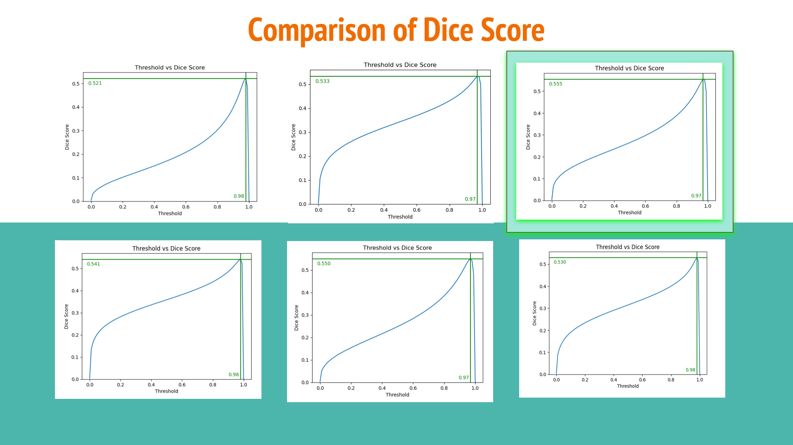
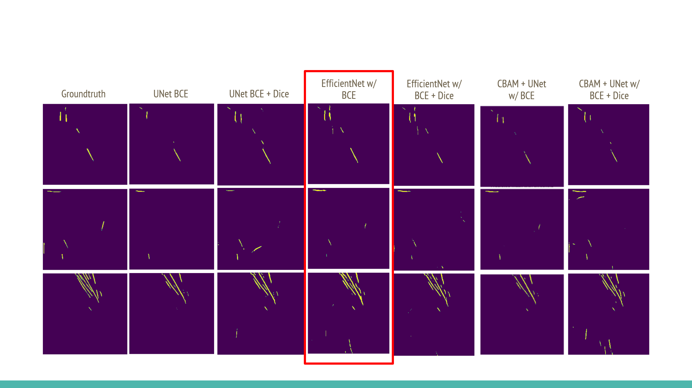
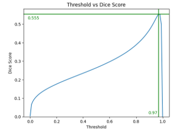
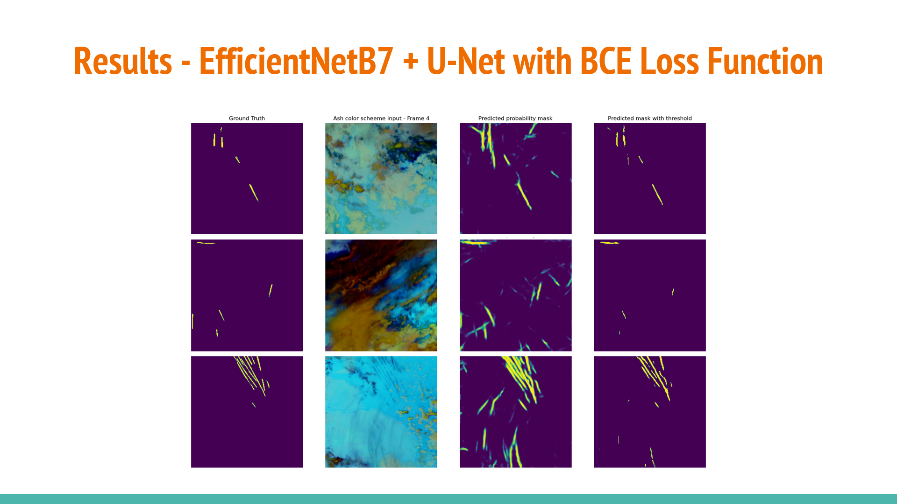

# Contrails-Segmentation

## Overview
Contrails (Condensation Trails), formed by ice crystals in aircraft exhaust, trap heat in the atmosphere and contribute to global warming. Improving contrail detection helps reduce aviation's environmental impact by enabling airlines to avoid creating them. Accurate contrail segmentation supports climate change mitigation efforts and promotes sustainable aviation.

So, in this task we are doing Contrails Segmentation using various method. Our approach is about comparing one method or architecture with another and trying to find the best result from it.

Our goal is to find better methods or architectures compared to the baseline we used.


## Pre-requisite
There are some pre-requisite need to be done. First, we will use this dataset from Kaggle competition Google Research - Identify Contrails to Reduce Global Warming (https://www.kaggle.com/competitions/google-research-identify-contrails-reduce-global-warming). The dataset is around 450GB in zipped format.

There are two way to run the script.
1. By running the script on local (if you have the computing resources).
2. By running the script on kaggle.

If you are planning to run it locally, make sure to have some space for downloading and extracting the dataset. If running locally, extract the dataset and don't change the name. Keep in mind the dataset path.

If you planning to run it on Kaggle, you can load the dataset by joining the competition first and then load the dataset into the notebook.

And for both, keep in mind that we use the baseline code from this code, Getting Started | EDA -> Model -> Train -> Submit (https://www.kaggle.com/code/mnokno/getting-started-eda-model-train-submit). For running our code, you can reference from this one.

We also provided some weights from our experiments that can be accessed here:
https://drive.google.com/drive/folders/1HIyXMjQGhtnN7UChZNa7nx6lAchNZGW4?usp=sharing

Keep these weights in a directory and later this path can be use for inference only.

## Usage
Here are the steps on how to use this project locally.
1. First, clone this repository.
```
git clone git@github.com:jychpr/Contrails-Segmentation.git
```
And move to the directory
```
cd Contrails-Segmentation
```
2. Create virtual environment. Here we use conda to create environment
```
conda create -n conseg python=3.12
```
And activate it
```
conda activate conseg
```
3. Then install the requirements using this command.
```
pip install -r requirements.txt
```
4. We will use jupyter lab to accress the notebook. After running the code below, just copy the link or URL for the interface
```
jupyter lab --no-browser
```
5. Go to the notebooks directory and choose one of the notebook to try the methods we try.

6. Then, search for the directory variable initialization and change to the dataset directory which will be similar to the current being set in the notebook files .ipynb

7. Changing all the directories at the code complete, then just run all the cells until the end of the script.

But for the EfficientNetB7UNet, there are two notebook, one for training and inference. If you want to try to run, you need to run the training first and stop the session and kill the kernel to reset the VRAM usage, and run the inference, but check the weights that has been produced by training.

For Inference run only.

1. Run steps 1-6 earlier

2. Find the model path in "Train" section, and change the model path with the weights path that is downloaded beforehand.

3. Continue steps 7 from earlier


## Experimentation and Hyperparameters
We have two setups.
1. By running the script on local (if you have the computing resources).

Run on PC with specs: GPU VRAM 24GB, Memory RAM 128GB

2. By running the script on kaggle.

Run with specs: GPU P100 in the settings

Inference run usage:
- Baseline UNet: 3-8GB VRAM
- CBAM+UNet: 10-16GB VRAM
- EfficientNetB7+Unet: 24GB VRAM (GPU with 24GB VRAM can run this inference)


We use uniform hyperparameters for all of our code which is the same with the reference baseline code, such as:
- Epoch: 11
- Optimizer: Adam
- Optimizer Learning Rate: 0.01

And for experimentation, we implement some methods and loss function as follows.

Methods:
1. Baseline UNet
2. EfficientNetB7 + UNet
3. CBAM + UNet

Metrics, Parameters, Hyperparameters tried:
1. BCE (Binary Cross-Entropy) only
2. BCE + Dice Loss Function

Here is the result of the data exploration.





## Experiment Results
Here is the comparison between Dice Score result


Here is the comparison betwwen segmentation results


The highest score achieved by EfficientNetB7+UNet with BCE loss function. Here are the results in display




## References
- Dataset: Google Research - Identify Contrails to Reduce Global Warming (https://www.kaggle.com/competitions/google-research-identify-contrails-reduce-global-warming)
- Baseline Code: Getting Started | EDA -> Model -> Train -> Submit (https://www.kaggle.com/code/mnokno/getting-started-eda-model-train-submit)
- Q. Yang, Z. Wang, S. Liu, and Z. Li, "Research on Improved U-net Based Remote Sensing Image Segmentation Algorithm," arXiv preprint arXiv:2408.12672, 2024. [Online]. Available: https://arxiv.org/abs/2408.12672.
- A. A. Nirob, S. Ahmed, T. K. Takee, A. R. Eshan, S. U. Haque, E. R. Rhythm, and A. A. Rasel, "Contrail Analysis through Advanced Neural Network Architectures: Image Segmentation and Classification," in 2023 26th International Conference on Computer and Information Technology (ICCIT), 2023, pp. 1–6. doi: 10.1109/ICCIT60459.2023.10441226.
- J. Y.-H. Ng, K. McCloskey, J. Cui, V. R. Meijer, E. Brand, A. Sarna, N. Goyal, C. Van Arsdale, and S. Geraedts, "Contrail Detection on GOES-16 ABI With the OpenContrails Dataset," IEEE Transactions on Geoscience and Remote Sensing, vol. 62, pp. 1–14, 2024, doi: 10.1109/TGRS.2023.3345226.
- R. Chevallier, M. Shapiro, Z. Engberg, M. Soler, and D. Delahaye, "Linear Contrails Detection, Tracking and Matching with Aircraft Using Geostationary Satellite and Air Traffic Data," Aerospace, vol. 10, no. 7, Art. no. 578, 2023, doi: 10.3390/aerospace10070578.
- Q. Lin, Q. Leng, Z. Ding, C. Yan, and X. Xu, "Optimizing Contrail Detection: A Deep Learning Approach with EfficientNet-b4 Encoding," in 2024 IEEE 4th International Conference on Electronic Technology, Communication and Information (ICETCI), 2024, pp. 504–508, doi: 10.1109/ICETCI61221.2024.10594699.
- K.-M. Vong and T. B. Dinh, "Pneumothorax Segmentation in Chest X-Rays Using UNet++ and EfficientNet," in 2021 IEEE EMBS International Conference on Biomedical and Health Informatics (BHI), 2021, pp. 1–4, doi: 10.1109/BHI50953.2021.9508531.
- S. M. N. Nobel, M. A. Hossain, M. M. Kabir, M. F. Mridha, S. Alfarhood, and M. Safran, "SegX-Net: A novel image segmentation approach for contrail detection using deep learning," PLOS ONE, vol. 19, no. 3, pp. 1–23, Mar. 2024, doi: 10.1371/journal.pone.0298160.
- J. P. Hoffman, T. F. Rahmes, A. J. Wimmers, and W. F. Feltz, "The Application of a Convolutional Neural Network for the Detection of Contrails in Satellite Imagery," Remote Sensing, vol. 15, no. 11, Art. no. 2854, 2023, doi: 10.3390/rs15112854.
- Y. Lee, E.-K. Kim, and J. Yoo, "Towards Robust Contrail Detection by Mitigating Label Bias via a Probabilistic Deep Learning Model: A Preliminary Study," in Proceedings of the 31st ACM International Conference on Advances in Geographic Information Systems (SIGSPATIAL '23), Hamburg, Germany, 2023, Art. no. 3, doi: 10.1145/3589132.3628364.
- D. P. Nikezić, D. S. Radivojević, I. M. Lazović, N. S. Mirkov, and Z. J. Marković, "Transfer Learning with ResNet3D-101 for Global Prediction of High Aerosol Concentrations," Mathematics, vol. 12, no. 6, Art. no. 826, 2024, doi: 10.3390/math12060826.

